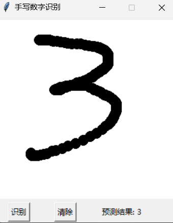

# 结合卷积神经网络和改进ResNet18的手写数字识别demo

本项目基于深度学习技术，构建并训练了一个改进的 ResNet18 模型，用于识别手写数字。主要功能包括数据预处理、模型训练与评估、模型结构可视化，以及一个图形用户界面（GUI）用于实时手写数字识别。

## 功能特性
- **数据预处理**：处理和准备训练与测试数据集。
- **模型训练**：使用改进的 ResNet18 模型进行训练，支持模型保存与加载。
- **模型评估**：评估模型在测试集上的表现，并生成评分报告。
- **模型可视化**：生成并保存模型的结构图，帮助理解模型架构。
- **图形用户界面（GUI）**：提供一个直观的界面，允许用户绘制手写数字并实时预测其类别。

## 模型性能


相较于传统的手写数字识别模型，该模型在测试集上的准确率达到99.81，损失低于0.0070，性能大大提高。

## 模型结构
`````````
ImprovedResNet18
│
├── Input Layer (1x28x28)
│
├── Initial Layers
│   ├── Conv2d (1→32, 3x3)
│   ├── BatchNorm2d
│   ├── ReLU
│   └── MaxPool2d (2x2)
│
├── Layer1 (2 Residual Blocks)
│   ├── ResidualBlock1
│   │   ├── Conv2d (32→32, 3x3)
│   │   ├── BatchNorm2d
│   │   ├── ReLU
│   │   ├── Conv2d (32→32, 3x3)
│   │   └── BatchNorm2d
│   │
│   └── ResidualBlock2
│       ├── Conv2d (32→32, 3x3)
│       ├── BatchNorm2d
│       ├── ReLU
│       ├── Conv2d (32→32, 3x3)
│       └── BatchNorm2d
│
├── Layer2 (2 Residual Blocks)
│   ├── ResidualBlock1 (with downsample)
│   │   ├── Conv2d (32→64, 3x3, stride=2)
│   │   ├── BatchNorm2d
│   │   ├── ReLU
│   │   ├── Conv2d (64→64, 3x3)
│   │   └── BatchNorm2d
│   │
│   └── ResidualBlock2
│       ├── Conv2d (64→64, 3x3)
│       ├── BatchNorm2d
│       ├── ReLU
│       ├── Conv2d (64→64, 3x3)
│       └── BatchNorm2d
│
├── Layer3 (2 Residual Blocks)
│   ├── ResidualBlock1 (with downsample)
│   │   ├── Conv2d (64→128, 3x3, stride=2)
│   │   ├── BatchNorm2d
│   │   ├── ReLU
│   │   ├── Conv2d (128→128, 3x3)
│   │   └── BatchNorm2d
│   │
│   └── ResidualBlock2
│       ├── Conv2d (128→128, 3x3)
│       ├── BatchNorm2d
│       ├── ReLU
│       ├── Conv2d (128→128, 3x3)
│       └── BatchNorm2d
│
├── Global Average Pooling
│
├── Dropout (p=0.5)
│
└── Fully Connected Layer (128→10)
`````````

## 如何运行
安装依赖包（如果事先以配置好环境，请忽略这一步）
`````````
pip install -r requirment.txt
`````````
训练模型
````````
python train.py
````````
测试模型
````````
python test.py
````````

## 直接运行GUI程序
训练完成后，可执行以下命令唤出手写弹窗
`````````
python app.py
`````````

## 数据集
使用MNIST数据集，包含60000张手写数字图片（采用灰度表示），其中80%用于训练集。20%用于验证集，可以下载[数据集](https://pan.baidu.com/s/1jAP1myo4ItWvo7av5t7OLQ)(提取码xdz8)使用

## 效果演示



  
